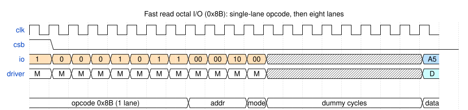
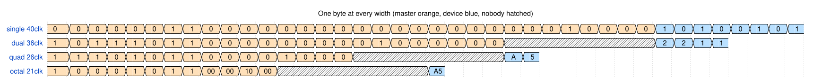
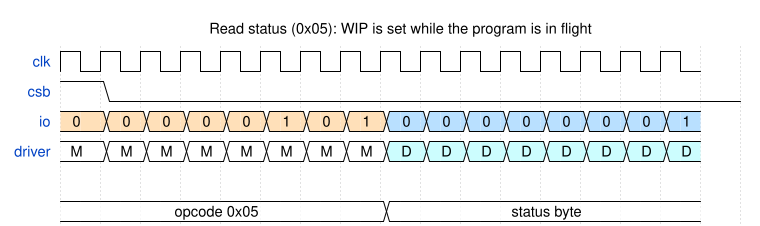

Waveforms
=========

Generated from real simulations rather than drawn by hand -- ``capture.py``
runs the transactions, Icarus dumps a VCD, and ``render.py`` samples it. They
cannot drift from what the models do.

Regenerate with::

    make -C docs/waveforms
    make -C docs/waveforms svg

   Fast read octal I/O

   One byte at every width

   Read status with WIP set
